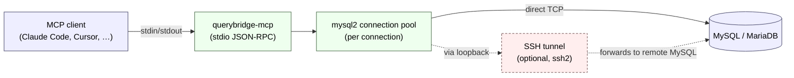

# querybridge-mcp

[](https://github.com/MahmoudHassanMustafa/querybridge-mcp/actions/workflows/ci.yml)

A Model Context Protocol (MCP) server that connects Claude Code to MySQL databases. Supports SSH tunnels, SSL/TLS, and multiple simultaneous connections.

## Contents

- [Features](#features)
- [How it fits together](#how-it-fits-together)
- [How it compares](#how-it-compares)
- [Quickstart](#quickstart)
- [Configuration](#configuration)
- [CLI](#cli)
- [Tools](#tools) — 39 tools across 9 categories
- [Resources & Prompts](#resources--prompts)
- [HTTP transport (remote MCP)](#http-transport-remote-mcp) — flags, security defaults, production deployment
- [Safety](#safety)
- [Project structure](#project-structure)
- [Contributing](#contributing)
- [License](#license)

## Features

- **39 tools** across schema introspection, querying, per-column profiling, FK navigation, ERD generation, stored programmability, operator admin, diagnostics (server snapshot, locks, slow queries), cross-database diffing, and advisory migration SQL.
- **2 MCP resources** for browsable schema access.
- **4 MCP prompts** for guided database workflows.
- **Two transports** — local stdio (Claude Code) and remote Streamable HTTP with bearer auth (Cursor, n8n, hosted agents).
- **SSH tunnel support** with password or private key authentication (and host-fingerprint pinning).
- **SSL/TLS support** for direct encrypted connections.
- **Multi-database** connections with independent configs.
- **Read-only by default** with per-connection write control.
- **CLI** for managing connections without editing JSON.

## How it fits together



The MCP client speaks JSON-RPC over the server's stdin/stdout. Each configured connection gets its own mysql2 pool — when SSH is configured the pool talks to a local ephemeral port that the ssh2 tunnel forwards to the remote MySQL. Tools call the pool; the pool checks out a connection, runs the query, and the result flows back as a tool response (plus an MCP `notifications/message` echo for observability).

## How it compares

There are several MCP-over-MySQL options. The honest pitch:

| Capability                                                                         | `querybridge-mcp` | Typical alternative                          |
| ---------------------------------------------------------------------------------- | ----------------- | -------------------------------------------- |
| Read-only by default (whitelist + server-side `SET SESSION transaction_read_only`) | ✅                | Usually whitelist only, or off by default    |
| `LOAD DATA LOCAL INFILE` blocked client-side                                       | ✅                | Rarely addressed                             |
| SSH tunnel built in (with host-fingerprint pinning)                                | ✅                | Often requires an external `ssh -L`          |
| Secrets indirection (`{ env: }` / `{ file: }`)                                     | ✅                | Usually plaintext in config                  |
| Cancellation via MCP signal → `KILL QUERY`                                         | ✅                | Typically abandoned client-side              |
| Cross-database schema diff (`compare_schemas`)                                     | ✅                | Rare                                         |
| Multi-arch Docker image with SBOM + Sigstore provenance                            | ✅                | Sometimes one platform only                  |
| Integration tests against real MySQL (Testcontainers)                              | ✅                | Often unit tests only                        |
| Tool annotations + `structuredContent` (modern MCP spec)                           | ✅                | Many still on the legacy `server.tool()` API |

If you need write access for migrations, raw replication setup, or admin operations beyond `KILL QUERY`, you may want a tool with looser defaults. querybridge-mcp leans hard on "give Claude a database without giving it the ability to destroy your data."

## Quickstart

### 1. Install

Install globally from npm:

```bash
npm install -g querybridge-mcp
```

Or run on demand without installing:

```bash
npx querybridge-mcp <command>
npx querybridge-mcp-server   # starts the MCP server
```

Or pull the Docker image (no Node install needed):

```bash
docker pull ghcr.io/mahmoudhassanmustafa/querybridge-mcp:latest
```

Check the version on any of the above:

```bash
querybridge-mcp --version       # or: querybridge-mcp-server --version
```

### 2. Create a config file

```bash
querybridge-mcp init             # creates an empty config
querybridge-mcp add production   # adds a connection interactively
```

See [Configuration](#configuration) for the file shape, env-var alternatives, and SSH / SSL options.

### 3. Register with Claude Code

```bash
claude mcp add querybridge-mcp -e QUERYBRIDGE_MCP_CONFIG=/path/to/config.json -- querybridge-mcp-server
```

Or manually in `~/.claude.json`:

```json
{
  "mcpServers": {
    "querybridge-mcp": {
      "type": "stdio",
      "command": "querybridge-mcp-server",
      "env": {
        "QUERYBRIDGE_MCP_CONFIG": "/path/to/config.json"
      }
    }
  }
}
```

If `querybridge-mcp-server` isn't on your PATH (e.g. not installed globally), swap `command` for `npx` with `"args": ["-y", "querybridge-mcp-server"]`.

### 3b. Register via Docker (optional)

For environments where Node/pnpm aren't installed, run the server from the published image. Mount your config read-only and let the container handle the rest:

```bash
claude mcp add querybridge-mcp -- \
  docker run --rm -i \
  -v /path/to/config.json:/config/config.json:ro \
  -e QUERYBRIDGE_MCP_CONFIG=/config/config.json \
  ghcr.io/mahmoudhassanmustafa/querybridge-mcp:latest
```

Or manually in `~/.claude.json`:

```json
{
  "mcpServers": {
    "querybridge-mcp": {
      "type": "stdio",
      "command": "docker",
      "args": [
        "run",
        "--rm",
        "-i",
        "-v",
        "/path/to/config.json:/config/config.json:ro",
        "-e",
        "QUERYBRIDGE_MCP_CONFIG=/config/config.json",
        "ghcr.io/mahmoudhassanmustafa/querybridge-mcp:latest"
      ]
    }
  }
}
```

Notes:

- `--rm -i` is required — `-i` wires stdio (the MCP transport); `--rm` cleans up the container after the client disconnects.
- For SSH tunnels you also need to bind-mount the private key: add `-v ~/.ssh/id_ed25519:/keys/id_ed25519:ro` and reference `/keys/id_ed25519` in your config's `ssh.privateKeyPath`.
- Pin to a specific version (`:v0.11.0`) for reproducibility; `:latest` follows the current release.
- The image runs as a non-root `node` user. Mounts must be readable by UID 1000.
- Multi-arch: `linux/amd64` + `linux/arm64`. Apple Silicon and Linux servers work out of the box.

For remote-client setups (Cursor, n8n, browser-based clients, hosted agents) see [HTTP transport (remote MCP)](#http-transport-remote-mcp).

## Configuration

Three ways to configure, in order of precedence:

### 1. Config file (recommended)

Set `QUERYBRIDGE_MCP_CONFIG` to a JSON file path, or use the CLI to build one.

```json
{
  "connections": [
    {
      "name": "local",
      "host": "127.0.0.1",
      "port": 3306,
      "user": "root",
      "password": "secret",
      "database": "myapp",
      "readonly": true,
      "queryTimeout": 30000
    }
  ]
}
```

### 2. Inline JSON

Set `QUERYBRIDGE_MCP_CONFIG_JSON` to a JSON string:

```bash
QUERYBRIDGE_MCP_CONFIG_JSON='{"connections":[{"name":"dev","host":"localhost","user":"root","password":"secret","database":"myapp"}]}'
```

### 3. Environment variables (single connection)

```bash
MYSQL_HOST=127.0.0.1
MYSQL_PORT=3306
MYSQL_USER=root
MYSQL_PASSWORD=secret
MYSQL_DATABASE=myapp
MYSQL_READONLY=true
MYSQL_QUERY_TIMEOUT=30000
MYSQL_CONNECTION_NAME=default
```

### Connection options

| Field          | Type             | Default  | Description                   |
| -------------- | ---------------- | -------- | ----------------------------- |
| `name`         | string           | required | Unique connection identifier  |
| `host`         | string           | required | MySQL hostname or IP          |
| `port`         | number           | `3306`   | MySQL port                    |
| `user`         | string           | required | MySQL username                |
| `password`     | string           |          | MySQL password                |
| `database`     | string           |          | Default database/schema       |
| `readonly`     | boolean          | `true`   | Block write operations        |
| `queryTimeout` | number           | `30000`  | Query timeout in milliseconds |
| `poolSize`     | number           | `5`      | mysql2 connection-pool size   |
| `ssh`          | object           |          | SSH tunnel configuration      |
| `ssl`          | object or `true` |          | SSL/TLS configuration         |

### Secrets indirection

`password`, `ssh.password`, and `ssh.passphrase` accept either a plain string OR an indirection object so credentials don't need to live in the config file:

```json
{
  "password": { "env": "PROD_DB_PASSWORD" },
  "ssh": {
    "host": "bastion.example.com",
    "username": "deploy",
    "passphrase": { "file": "~/.secrets/ssh-passphrase" }
  }
}
```

| Form                          | Behavior                                                               |
| ----------------------------- | ---------------------------------------------------------------------- |
| `"secret"`                    | Plain string (back-compat, fine for dev)                               |
| `{ "env": "VAR_NAME" }`       | Read from `process.env.VAR_NAME` at startup. Errors if unset or empty. |
| `{ "file": "/path/to/file" }` | Read file contents (tilde-expanded, trailing whitespace trimmed).      |

Resolution happens once at config load; downstream code only sees the resolved string.

### SSH tunnel

Tunnel MySQL traffic through an SSH bastion host. Supports password and private key authentication.

```json
{
  "name": "production",
  "host": "rds-internal.example.com",
  "port": 3306,
  "user": "app",
  "password": "secret",
  "database": "prod",
  "readonly": true,
  "ssh": {
    "host": "bastion.example.com",
    "port": 22,
    "username": "deploy",
    "privateKeyPath": "~/.ssh/id_rsa",
    "passphrase": "optional",
    "hostFingerprint": "SHA256:AAAA...=="
  }
}
```

| Field             | Type   | Default  | Description                                                                                                                                                                                              |
| ----------------- | ------ | -------- | -------------------------------------------------------------------------------------------------------------------------------------------------------------------------------------------------------- |
| `host`            | string | required | SSH server hostname                                                                                                                                                                                      |
| `port`            | number | `22`     | SSH port                                                                                                                                                                                                 |
| `username`        | string | required | SSH username                                                                                                                                                                                             |
| `password`        | string |          | SSH password                                                                                                                                                                                             |
| `privateKeyPath`  | string |          | Path to private key (supports `~/`)                                                                                                                                                                      |
| `passphrase`      | string |          | Private key passphrase                                                                                                                                                                                   |
| `hostFingerprint` | string |          | Pinned SHA256 fingerprint of the SSH server's host key (format: `ssh-keygen -lf`). When unset, the server logs a warning and accepts any host key. Get it with `ssh-keyscan <host> \| ssh-keygen -lf -`. |

### SSL/TLS

For direct encrypted connections (without SSH):

```json
{
  "ssl": true
}
```

Or with custom certificates:

```json
{
  "ssl": {
    "ca": "~/.ssl/ca.pem",
    "cert": "~/.ssl/client-cert.pem",
    "key": "~/.ssl/client-key.pem",
    "rejectUnauthorized": true
  }
}
```

## CLI

The CLI manages your `config.json` without editing it by hand. After `npm install -g querybridge-mcp`, the `querybridge-mcp` command is on your PATH.

### Commands

| Command                         | Description                        |
| ------------------------------- | ---------------------------------- |
| `querybridge-mcp list`          | List all configured connections    |
| `querybridge-mcp add [name]`    | Add a new connection (interactive) |
| `querybridge-mcp remove <name>` | Remove a connection                |
| `querybridge-mcp test [name]`   | Test one or all connections        |
| `querybridge-mcp init`          | Create an empty config file        |

### Examples

```bash
# Create config and add first connection interactively
querybridge-mcp init
querybridge-mcp add production

# Test all connections
querybridge-mcp test

# Test a specific connection
querybridge-mcp test production

# Remove a connection
querybridge-mcp remove staging
```

Set `QUERYBRIDGE_MCP_CONFIG` in your shell profile so the CLI always finds your config:

```bash
export QUERYBRIDGE_MCP_CONFIG=~/.config/querybridge-mcp/config.json
```

## Tools

Every tool takes `connection: string` as its first argument; schema-targeted tools also take an optional `database`. Tools that operate on a single table accept either `table: string` (returns a flat shape) or `tables: string[]` (returns `{ results: [...] }` — convenient for batch lookups). Where supported, omitting both runs against every table in the database.

### Connection management

| Tool               | Description                                                |
| ------------------ | ---------------------------------------------------------- |
| `list_connections` | List all connections with status, host, SSH/SSL indicators |
| `list_databases`   | List all databases accessible on a connection              |
| `use_database`     | Switch the active database/schema for a connection         |

### Schema introspection

| Tool               | Description                                                                                                                              |
| ------------------ | ---------------------------------------------------------------------------------------------------------------------------------------- |
| `list_tables`      | List tables with row counts and engine info                                                                                              |
| `list_views`       | List views with definer, security type, updatability                                                                                     |
| `describe_table`   | Show columns, indexes, and CREATE TABLE statement. Single-table via `table`; batch via `tables: [...]` (returns `{ results: [...] }`)    |
| `describe_view`    | Show columns and CREATE VIEW DDL of a view                                                                                               |
| `get_ddl`          | Get clean CREATE TABLE DDL. Single-table via `table`; batch via `tables: [...]`                                                          |
| `get_view_ddl`     | Get clean CREATE VIEW DDL (raw, not truncated)                                                                                           |
| `get_foreign_keys` | Show FK relationships with cascade rules. `table` for one table; `tables: [...]` for a subset; omit both for every table in the database |
| `get_indexes`      | Show indexes with duplicate detection. `table` / `tables: [...]` / omit both for one / some / all                                        |
| `search_columns`   | Find columns by name pattern across all tables                                                                                           |

### Query execution

| Tool              | Description                                                                                                                                                                                                                                                                                                                                                                                                                                                       |
| ----------------- | ----------------------------------------------------------------------------------------------------------------------------------------------------------------------------------------------------------------------------------------------------------------------------------------------------------------------------------------------------------------------------------------------------------------------------------------------------------------- |
| `execute_query`   | Run SQL with parameterized values. Writes blocked on read-only connections                                                                                                                                                                                                                                                                                                                                                                                        |
| `explain_query`   | Run EXPLAIN in TRADITIONAL, JSON, or TREE format                                                                                                                                                                                                                                                                                                                                                                                                                  |
| `streaming_query` | Stream a large SELECT to a file on disk. `format` selects the encoding: `ndjson` (default, line-streaming-friendly), `json` (single JSON-array document), or `csv` (RFC 4180, header from first row). Bypasses `execute_query`'s 1k-row in-memory cap. Row + byte caps both apply; hitting either issues `KILL QUERY` on the worker and marks the result `truncated`. Writes to a temp file and renames on success; the temp file is unlinked on failure or abort |

### Data inspection

| Tool              | Description                                                                                                                                                                                                                                                                           |
| ----------------- | ------------------------------------------------------------------------------------------------------------------------------------------------------------------------------------------------------------------------------------------------------------------------------------- |
| `get_table_stats` | Row counts, data/index sizes, timestamps. Three modes: `table` for one; `tables: [...]` for a specific subset; omit both for every table (the "which tables are huge?" mode)                                                                                                          |
| `sample_data`     | Preview rows from a table (default: 5 rows)                                                                                                                                                                                                                                           |
| `column_stats`    | Per-column profile — null %, distinct count, min/max/avg, optional top-N most common values. One combined-aggregation query per call; type-aware metric selection (no AVG on text, no MIN/MAX on BLOB)                                                                                |
| `traverse_fk`     | Walk FK relationships outward from a seed row (`table`, `primary_key_value`). Returns a cycle-detected `{ nodes, edges }` graph. Direction `children` / `parents` / `both`; bounded by depth (max 3), per-step row cap (max 50), and a 200-node total cap. V1: single-column PKs only |

### Stored routines and programmability

| Tool              | Description                                  |
| ----------------- | -------------------------------------------- |
| `list_routines`   | List stored procedures and functions         |
| `get_routine_ddl` | Get full DDL for a procedure or function     |
| `list_triggers`   | List triggers, optionally filtered by table  |
| `get_trigger_ddl` | Get full trigger definition                  |
| `list_events`     | List scheduled events with status and timing |
| `get_event_ddl`   | Get full event definition                    |

### Visualization

| Tool           | Description                                                                     |
| -------------- | ------------------------------------------------------------------------------- |
| `generate_erd` | Generate a Mermaid ER diagram with tables, columns, PKs, FKs, and relationships |

### Operator / admin

| Tool                    | Description                                                                                  |
| ----------------------- | -------------------------------------------------------------------------------------------- |
| `list_processes`        | Show running connections + their current queries (filter by minimum duration)                |
| `kill_query`            | KILL QUERY (or KILL CONNECTION) by process ID. Gated: requires `readonly: false`             |
| `get_unused_indexes`    | Detect secondary indexes with zero reads in `performance_schema` and produce DROP statements |
| `get_charset_collation` | Show character set and collation at database, table, and column levels                       |

### Diagnostics

| Tool             | Description                                                                                                                                                                                                               |
| ---------------- | ------------------------------------------------------------------------------------------------------------------------------------------------------------------------------------------------------------------------- |
| `server_info`    | Bird's-eye snapshot — version, hostname, uptime, thread counts (running/connected/max), key charset & collation, SQL mode, time zone, read-only flags                                                                     |
| `show_variables` | `SHOW VARIABLES` with `pattern` (LIKE) + `scope` (GLOBAL / SESSION) filters                                                                                                                                               |
| `show_status`    | `SHOW STATUS` with the same filter / scope pattern — runtime counters                                                                                                                                                     |
| `current_locks`  | Active InnoDB lock-wait pairs from `performance_schema.data_lock_waits` joined to thread + statement info. Surfaces every blocker → blocked relationship with the SQL each thread is running. Needs SELECT on perf_schema |
| `innodb_status`  | Raw `SHOW ENGINE INNODB STATUS` dump (transactions, buffer pool, LSN). Parses the `LATEST DETECTED DEADLOCK` section separately when present                                                                              |
| `slow_queries`   | Top query digests from `performance_schema.events_statements_summary_by_digest`. Sort by total / avg / max time, or count. Needs SELECT on perf_schema                                                                    |

### Cross-database diffing

| Tool                  | Description                                                                                                                                                                                                                                                                                                                                                                                                                                                                                                                                                                                                                                   |
| --------------------- | --------------------------------------------------------------------------------------------------------------------------------------------------------------------------------------------------------------------------------------------------------------------------------------------------------------------------------------------------------------------------------------------------------------------------------------------------------------------------------------------------------------------------------------------------------------------------------------------------------------------------------------------- |
| `compare_schema_file` | Diff a checked-in `.sql` schema file against a live database. Loads the file into a temp DB on a writable scratch connection, delegates to the same engine `compare_schemas` uses, and drops the temp DB. Designed for CI drift detection against a source-of-truth schema. V1 doesn't support `DELIMITER` blocks — stored routines / triggers in the file won't parse cleanly.                                                                                                                                                                                                                                                               |
| `compare_schemas`     | Diff two databases (potentially across connections). Reports drift across **9 aspects**: tables, table attributes (engine/charset/**partitioning**), columns (incl. comments, generated cols), indexes (incl. MySQL 8 invisible indexes, functional indexes, prefix lengths), foreign keys, views, routines, triggers, events. SQL bodies are whitespace-normalized; int display widths are normalized for cross-version (5.7 ↔ 8.0+) sanity. Restrict with `tables` filter or `scope` for cheaper runs. `summaryOnly: true` keeps huge diffs in context budget. Emits MCP progress notifications per scope. Honors client-side cancellation. |
| `generate_migration`  | Advisory-only ALTER/CREATE/DROP SQL generator. Diffs source vs target, emits SQL **without executing** — phased for safe application (drop FKs → drop indexes → drop columns → modify → add columns → add indexes → add FKs → drop tables → create tables). DROP and MODIFY are opt-in via flags. Every destructive line is preceded by a `-- WARNING:` comment; output leads with a "DO NOT EXECUTE BLINDLY" banner. V1: tables, columns, indexes, FKs (no views/routines/triggers/events).                                                                                                                                                  |

## Resources & Prompts

### Resources

MCP resources let Claude browse schema information without explicit tool calls.

| URI Pattern                                      | Description                                      |
| ------------------------------------------------ | ------------------------------------------------ |
| `mysql://{connection}/{database}/{table}/schema` | Table schema with columns and DDL                |
| `mysql://{connection}/{database}/overview`       | Database overview with all tables and row counts |

### Prompts

Pre-built prompt templates that guide Claude through multi-step database workflows. They appear in the MCP prompt list — select one and provide the required arguments (connection name, database, etc.) to start a guided workflow.

| Prompt             | Description                                                                           |
| ------------------ | ------------------------------------------------------------------------------------- |
| `explore_database` | Discover tables, schemas, FKs, routines, triggers, events, and generate an ERD        |
| `optimize_query`   | Analyze a query with EXPLAIN, check indexes, suggest improvements                     |
| `find_data`        | Search columns by pattern, sample tables, build a query                               |
| `audit_schema`     | Check for missing PKs, redundant indexes, empty tables, catalog routines and triggers |

## HTTP transport (remote MCP)

`querybridge-mcp-server` ships two transports: **stdio** (default — what Claude Code uses) and **Streamable HTTP** (for Cursor, n8n, hosted agents, browser-based clients). The HTTP transport implements the [MCP Streamable HTTP spec](https://modelcontextprotocol.io/specification/2024-11-05/basic/transports) with stateful sessions so log forwarding and progress notifications work end-to-end.

### Quick start (local)

```bash
export QUERYBRIDGE_MCP_HTTP_TOKEN=$(openssl rand -base64 32)
querybridge-mcp-server --transport=http --port=8080
```

Client config:

```json
{
  "mcpServers": {
    "querybridge-mcp": {
      "type": "streamable-http",
      "url": "http://127.0.0.1:8080/mcp",
      "headers": { "Authorization": "Bearer <YOUR_TOKEN_HERE>" }
    }
  }
}
```

### Flags

| Flag                      | Default     | Notes                                                                                                                  |
| ------------------------- | ----------- | ---------------------------------------------------------------------------------------------------------------------- |
| `--transport=stdio\|http` | `stdio`     |                                                                                                                        |
| `--port`                  | `8080`      |                                                                                                                        |
| `--host`                  | `127.0.0.1` | Loopback by default. Set `--host=0.0.0.0` to expose externally; the server then **requires** `--allowed-hosts`.        |
| `--path`                  | `/mcp`      | The HTTP path the transport serves on.                                                                                 |
| `--allowed-hosts`         | (none)      | Comma-separated Host-header allowlist. Required when binding to a non-loopback address. Defends against DNS-rebinding. |
| `--no-auth`               | off         | Opt out of bearer auth. Logged as a warning on every startup. Useful for `127.0.0.1`-only dev setups.                  |
| `--cors-origin`           | (none)      | Permissive CORS for a single origin. Skip unless a browser-based MCP client needs it.                                  |

### Environment variables

- `QUERYBRIDGE_MCP_HTTP_TOKEN` — bearer token clients must send. **Required** unless `--no-auth` is set; the server refuses to start otherwise.

### Security defaults

Read these once before exposing the server:

- **Bearer required by default.** The two-key opt-out (token absent AND `--no-auth`) prevents accidentally disabling auth via env-var typo.
- **Loopback-only by default.** External binding (`--host=0.0.0.0`) requires `--allowed-hosts` so a DNS-rebinding attack from a browser can't reach the server.
- **No CORS by default.** Same-origin RPC is the norm for MCP; cross-origin is opt-in.
- **All security guarantees of the stdio transport still apply** — read-only enforcement, LOAD INFILE block, KILL QUERY cancellation, error sanitization. The HTTP layer is just a different envelope.

### Production deployment

The defaults — loopback + bearer token — are designed for the "operator and agent on the same host" trust boundary. For anything beyond that (LAN, public internet, multi-tenant access), the bearer-only model is necessary but not sufficient. Bearer tokens travel on every request, never expire, and grant access to every tool on every configured connection. The standard recipe to harden this is to **front the server with a TLS-terminating auth proxy** and keep querybridge itself on loopback.

What the bearer token alone does NOT protect against, and how to address each:

| Gap                                                                                                                                      | Mitigation                                                                                                                                                                                    |
| ---------------------------------------------------------------------------------------------------------------------------------------- | --------------------------------------------------------------------------------------------------------------------------------------------------------------------------------------------- |
| **Wire interception.** The server speaks plaintext HTTP; an observer on any non-loopback network captures the token.                     | Terminate TLS at a reverse proxy (Caddy / nginx / Cloudflare) and run querybridge on loopback.                                                                                                |
| **No expiry / rotation.** A token leaked once is valid until the next restart.                                                           | Rotate by restarting the server with a new env var. For real rotation discipline, put an OAuth2/OIDC proxy in front that issues short-lived service tokens.                                   |
| **No scope.** One token → every tool, every connection. A leaked token can `execute_query` `DROP TABLE` against any writable connection. | Set `"readonly": true` on every connection that doesn't need writes. This is the actual blast-radius control — far stronger than auth alone.                                                  |
| **No replay protection.** A captured request + header is replayable.                                                                     | TLS prevents the capture in the first place.                                                                                                                                                  |
| **No rate limiting.**                                                                                                                    | Reverse-proxy-level rate limits (`limit_req` in nginx, `rate_limit` in Caddy).                                                                                                                |
| **No per-user audit.** Every call logs as the same anonymous bearer.                                                                     | OIDC proxy that forwards a verified `X-Forwarded-User` header you can route on. querybridge itself does not currently consume this — but the network-edge identity is the right place for it. |

#### Minimal TLS-terminating proxy (Caddy)

```caddyfile
mcp.example.com {
    reverse_proxy 127.0.0.1:8080
}
```

Start querybridge alongside it:

```bash
QUERYBRIDGE_MCP_HTTP_TOKEN=$(openssl rand -base64 32) \
querybridge-mcp-server --transport=http --host=127.0.0.1 --port=8080
```

Caddy obtains and renews the certificate automatically. Don't pass `--allowed-hosts` in this layout — Caddy already filters incoming `Host`, and querybridge sees the proxy connection on loopback. Clients connect to `https://mcp.example.com/mcp` with `Authorization: Bearer <token>`.

#### Stronger identity (OAuth2 / OIDC)

When you need per-user identity, SSO revocation, or short-lived tokens, put `oauth2-proxy`, [Pomerium](https://www.pomerium.com/), or [Cloudflare Access](https://www.cloudflare.com/products/zero-trust/access/) in front of the reverse proxy. The auth proxy verifies the user against your IdP, then injects a static service token toward querybridge:

```
Internet → Cloudflare Access → Caddy → querybridge (loopback, --no-auth)
            (verifies user)              ↑ trusts the upstream layer
```

Pass `--no-auth` to querybridge in this layout — the upstream proxy is the security boundary, and a double-token check just confuses operations. Keep `--host=127.0.0.1` so the only path to querybridge is through the proxy.

#### Defense-in-depth checklist

- [ ] TLS terminated by something in front (querybridge itself does not do TLS).
- [ ] querybridge bound to `127.0.0.1` — never `0.0.0.0` on a public interface.
- [ ] Every connection that doesn't strictly need writes has `"readonly": true`.
- [ ] Strong token (`openssl rand -base64 32` or stronger), or `--no-auth` _only_ when the upstream proxy is the trust boundary.
- [ ] Reverse-proxy rate limits set per your traffic shape.
- [ ] Network ACLs restrict who can reach the proxy (VPN / VPC / Tailscale / Cloudflare Access — pick one).
- [ ] Logs from querybridge (stderr) shipped somewhere you can audit. Every tool invocation is logged with tool name, connection, and elapsed ms.

querybridge is intentionally not an identity provider — building JWT verification, key rotation, and per-user scoping into the server would duplicate purpose-built infrastructure. The pattern the industry has settled on for tools like this is "delegate auth to a sidecar," which is why the recommended path is a reverse proxy rather than additional flags.

### Container example

```bash
docker run --rm -p 8080:8080 \
  -e QUERYBRIDGE_MCP_CONFIG_JSON='{"connections":[...]}' \
  -e QUERYBRIDGE_MCP_HTTP_TOKEN="$YOUR_TOKEN" \
  ghcr.io/mahmoudhassanmustafa/querybridge-mcp:latest \
  --transport=http --host=0.0.0.0 --allowed-hosts=localhost
```

## Safety

- **Read-only by default.** Write queries (INSERT, UPDATE, DELETE, DROP, ALTER, CREATE, TRUNCATE) are blocked unless `"readonly": false` is set on the connection.
- **Server-side read-only enforcement.** Read-only pools also run `SET SESSION transaction_read_only = 1, sql_safe_updates = 1` on every connection, so even a parser bypass is rejected by MySQL itself.
- **LOAD DATA LOCAL INFILE disabled.** The `LOCAL_FILES` capability is dropped from the client handshake and the `infileStreamFactory` is hard-wired to throw — a malicious MySQL server cannot read files from the MCP host.
- **Parameterized queries.** The `execute_query` tool uses prepared statements with `?` placeholders to prevent SQL injection.
- **Result limits.** Unbounded SELECT queries are auto-limited to 1000 rows. Table output is additionally capped at 256KB with a truncation note; individual cell values are truncated at 120 characters.
- **Bounded file output.** `streaming_query` writes to operator-supplied paths but refuses `/proc`, `/dev`, `/sys`, `/boot`, refuses to clobber existing files unless `overwrite: true`, and enforces both a 1 GiB byte cap and a 1M-row cap by default (10 GiB / 100M hard ceilings). Cap-stop triggers `KILL QUERY` on the worker rather than just abandoning the stream.
- **Scoped scratch privileges.** `compare_schema_file` requires a writable scratch connection but always creates temp databases under the `_qbmcp_check_*` prefix. Scope the scratch MySQL user to that namespace rather than `*.*` so a hostile agent with that user can't reach beyond the scratch space — see `SECURITY.md` for the recommended `GRANT` statement.
- **Cancellable queries.** If the MCP client cancels a request, `execute_query` and `explain_query` issue `KILL QUERY` on a sibling connection so the in-flight statement is stopped at the server, not just abandoned by the client.
- **Tool annotations.** Every tool advertises MCP `readOnlyHint` / `destructiveHint` / `idempotentHint` so clients (and humans) can gate confirmation prompts appropriately.
- **Structured results.** Tools return both human-readable text AND `structuredContent` JSON, so clients that support the modern MCP spec can render rich tables instead of monospace ASCII.
- **LLM-friendly errors.** Tool failures carry a stable `code` and a list of `suggestions` (`{ tool, reason, args? }`) in `structuredContent`, plus a rendered "Try one of these tools next:" bullet list in the text body. When the failing call already knew the relevant `connection` / `database` / `table`, those values are pre-filled in the suggested invocation — the agent doesn't re-derive context from the error message.
- **Audit logging.** Every tool invocation is logged to stderr with the connection, elapsed ms, and pre-condition rejections — so operators can see exactly what the agent did. Logs are also forwarded to the MCP client via `notifications/message` (per spec) so connected clients see them inline.
- **Config file in .gitignore.** The `config.json` file containing credentials is excluded from version control.

For exposing the HTTP transport beyond loopback, see [Production deployment](#production-deployment).

## Project structure

```
src/
  server/     Transport — stdio + Streamable HTTP + admin CLI
  tools/      One file (or directory) per tool family
  db/         Repository layer (introspection, runner, resolve, cancel, retry)
  sql/        SQL primitives (identifier escape, read-only whitelist)
  types/db.ts Shared domain types
  connection.ts  mysql2 pool + SSH tunnel lifecycle
  schema.ts   Zod config schemas
  errors.ts   QueryBridgeError + typed subclasses
  limits.ts   Centralized constants (timeouts, budgets, chunks)
  log.ts      Logger + AsyncLocalStorage trace context
  resources.ts / prompts.ts  MCP resource & prompt templates
config.json          Your connections (gitignored)
config.example.json  Sanitized template
```

Imports flow one direction: **Transport → Tools → Infrastructure**, enforced by `.dependency-cruiser.cjs`. See `CONVENTIONS.md` §1 for the full rules and `CLAUDE.md` for a 60-second agent briefing.

## Contributing

See [CONTRIBUTING.md](CONTRIBUTING.md). PRs add a [changeset](https://github.com/changesets/changesets) describing the user-visible effect; releases are automated.

## License

MIT
